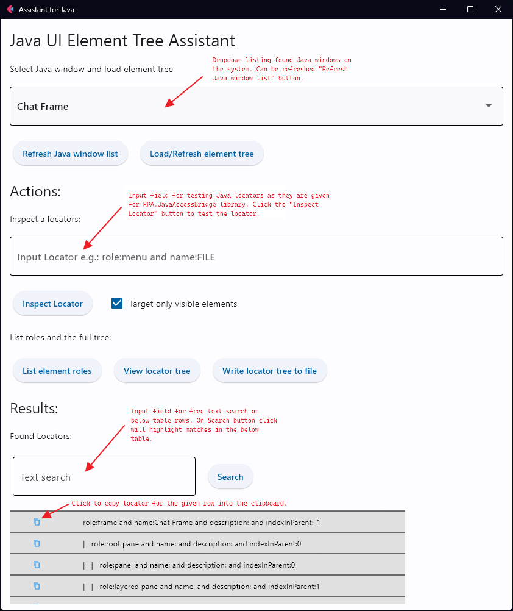
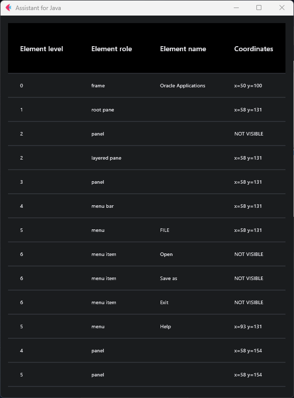

# Working with Java

## Introduction

This repository contains some helpful (hopefully :) ) tips for the developer on how to work with
Java applications. Especially concentrating on Java application element structure and
building locators that work.

Recent ``rpaframework`` have included improvements on how to interact with Java application information. It is now possible for example to iterate through Java structures although improvements on the library part are still going to be improved in the future releases. It is also possible to test locators against output from keyword ``Print Element Tree`` even when target Java application is not running.

Repository consists:

- example Java application `BasicSwing.jar` which is used in ``rpaframework`` testing
- [RPA.Assistant](https://robocorp.com/docs/libraries/rpa-framework/rpa-assistant) based implementation of developer "Java inspector tool" in `assistant.robot` file
- the some common routines for automating Java application in `tasks.robot` file
- Python code example how to work with the library in `task.py` file

### Configurations

1. The path to the Java access bridge DLL is given directly is given directly in the Robot implementations (`tasks.robot`, `assistant.robot`) as library init parameter `access_bridge_path`. Alternative is to set environment variable `RC_JAVA_ACCESS_BRIDGE_DLL` to the DLL location.
2. Also library init parameter `ignore_callbacks=True` is set as this is case especially for
older Java applications.

### Background story

The current recommended way of inspecting Java application element structure is to use [Google's Access Bridge Explorer](https://github.com/google/access-bridge-explorer) application. Unfortunately repository for this tool has been archived since July 27th 2022 thus it is important to investigate alternative ways for developers to work with Java applications.

**Note.** Contents of this repository are still under work and due to change!

## Element tree

The **element tree** is a representation of the Java application's structure and this can be output with library keyword ``Print Element Tree``.

Important aspect to note about element tree is that it is representation of the **current state** of the application. If application page structure changes in any way then usual method is to call library keyword ``Application Refresh`` so that library's internal model of the structure is updated.

## Iterating Java context tree

**Note.** This will get better in the future releases of `rpaframework` but currently iteration works like this

Robot Framework example (really clunky)
```robotframework
Iterating RPA.JavaAccessBridge context_info_tree
    ${lib}=    Get Library Instance    RPA.JavaAccessBridge
    Select Window By Title    Oracle Applications
    FOR    ${item}    IN    @{lib.context_info_tree}
        Log To Console    \nname: ${{ $item.context_info.name }}
        Log To Console    role: ${{ $item.context_info.role }}
        Log To Console    x: ${{ $item.context_info.x }}
        Log To Console    y: ${{ $item.context_info.y }}
        Log To Console    width: ${{ $item.context_info.width }}
        Log To Console    height: ${{ $item.context_info.height }}
        Log To Console    states: ${{ $item.context_info.states }}
        Log To Console    ancestry: ${{ $item.ancestry }}
    END
```

Python example
```python
from RPA.JavaAccessBridge import JavaAccessBridge

java = JavaAccessBridge()

java.select_window_by_title("Oracle Applications")
for item in java.context_info_tree:
    print(f"\nname: {item.context_info.name}")
    print(f"role: {item.context_info.role}")
    print(f"x: {item.context_info.x}")
    print(f"y: {item.context_info.y}")
    print(f"width: {item.context_info.width}")
    print(f"height: {item.context_info.height}")
    print(f"states: {item.context_info.states}")
    print(f"ancestry: {item.ancestry}")
```

## Starting the BasicSwing.jar

```bash
java -jar BasicSwing.jar
```
By default application's title will be "`Chat Frame`" but this JAR file can be started by adding arguments to give the application a different title.

for example.
```
java -jar BasicSwing.jar "Oracle Applications"
```

## Using Robocorp Assistant to inspect Java application

Probably most interesting approach on how to work with Java application is the Assistant application implementation.

```bash
Robocorp Task: Assistant
```

Assistant will automatically use `Select Window` to get access Java available on the system.



Assistant can be used to test locator against visible and selected Java application by entering locator into input field and then by clicking `Inspect` (the hidden elements can be seen in inspect result by unchecking `Only visible` checkbox) .

The `Refresh` button can be used to call `Application Refresh` keyword of the library.

The `List element roles` button lists all possible different element roles and their count on the application view.

The `Check element tree` opens the application's element tree on new page for view. On a condensed table the element's level on the hierarchy, role, name and coordinates are shown. If element does not have coordinates that are clickable (positive coordinates) then instead of coordinates text "NOT VISIBLE" is shown.



## Using command line tool `java_tree_reader`

The `java_tree_reader` command line tool is available in Robot's Python environment, which can be launched with Robocorp Extension's `Open Robot Terminal`.

This tool takes in 2 input arguments, first the path to the element tree output file and second the locator you want to run against that element tree output to check for matches.

```bash
java_tree_reader   elementtree.txt   role:push button and name:Send
```


## Learning materials

- [RPA.JavaAccessBridge library](https://robocorp.com/docs/libraries/rpa-framework/rpa-javaaccessbridge)
- [Robocorp Developer Training Courses](https://robocorp.com/docs/courses)
- [Documentation links on Robot Framework](https://robocorp.com/docs/languages-and-frameworks/robot-framework)
- [Example bots in Robocorp Portal](https://robocorp.com/portal)
